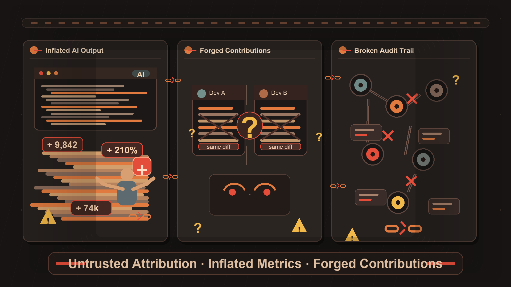
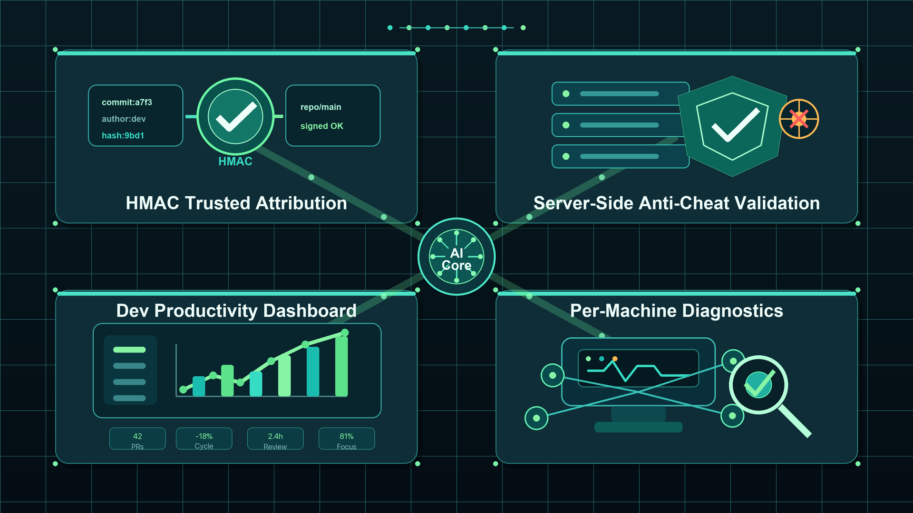
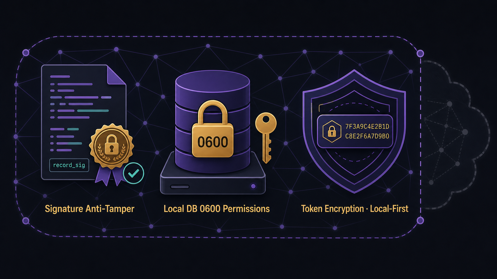

<sub>🌐 <a href="README.md">简体中文</a> · <b>English</b> · <a href="README.ja.md">日本語</a> · <a href="README.ko.md">한국어</a></sub>

<div align="center">

# aitrack self-hosted AI coding governance 🛡️

> *「Bring AI coding behavior into trusted auditing — give your engineering effectiveness team real data.」*

<a href="https://github.com/MapleEve/company-aitrack/actions/workflows/ci.yml"></a>
<a href="https://codecov.io/gh/MapleEve/company-aitrack"></a>
<a href="https://github.com/MapleEve/company-aitrack/releases"></a>
<a href="LICENSE"></a>
<a href="docs/DEPLOYMENT.md"></a>

<br>
<br>


<br>

aitrack is a general, self-hosted, open-source monitoring and governance tool for employee AI coding activity.<br>It provides native edit hook adapters for Claude Code, Codex CLI, and Cursor,<br>generates HMAC-signed edit evidence at every supported edit event,<br>and manages additional AI coding tools through a dynamic agent registry, heartbeat status, and local usage sources.

<br>

[Quick Start](#quick-start) · [Architecture](#architecture) · [Deploy](docs/DEPLOYMENT.md) · [API](docs/API.md) · [Contribute](CONTRIBUTING.md)

</div>

---

## Problem

<p align="center">
  
</p>

AI coding tools have entered engineering teams at scale, creating three governance challenges that are hard to ignore:

| Pain Point | Reality |
|------------|---------|
| **AI output is hard to attribute reliably** | No native mechanism distinguishes "AI-written" from "human-written" code — reporting tools are meaningless |
| **Line-count metrics are easy to game** | Trivial pastes, redundant completions, and meaningless repetition all inflate line counts far beyond actual contribution |
| **Attribution data can be forged** | Local statistics can be modified before submission — administrators have no way to assess data trustworthiness |

---

## Who It's For

<p align="center">
  
</p>

| Role | Core Need |
|------|-----------|
| **Engineering Effectiveness Teams** | Objectively quantify actual AI tool output, identify low-efficiency usage patterns, support monthly effectiveness reports |
| **Engineering Managers** | Real-time visibility into native hook and registered agent status plus suspicious data flags — no longer dependent on developer self-reporting |
| **Privacy-conscious · Self-hosting Teams** | All data stays on self-hosted infrastructure, never passes through any third-party cloud service, meeting compliance requirements |

---

## Architecture

aitrack consists of three independent components communicating via Protocol v1.2:

| Component | Stack | Responsibility |
|-----------|-------|----------------|
| **Rust client** `aitrack` | Rust · single binary · no runtime dependencies · hexagonal architecture (v1.6) | Install hooks, capture edit events, HMAC signing, upload data, auto-update (ed25519) |
| **Java server** `aitrack-server` | Java 17 · Spring Boot 3.3.8 · H2 / PostgreSQL · ParadeDB (v1.3+) | 10-step validation chain, trusted attribution, effectiveness queries, semantic search (primary implementation) |
| **Go server** `aitrack-server-go` | Go 1.25 · chi v5.2.5 · PostgreSQL / ParadeDB (required) | Feature-equivalent lightweight alternative implementation with semantic search support |

**Protocol v1.2 key design:**

- All upload requests include `record_sig` (HMAC-SHA256 covering 11 core fields) and a request-level HMAC signature
- `POST /admin/tokens` returns a single `credential` field (`<token>-<hmac_secret>`), simplifying issuance and client configuration
- `hostname` field (new in v1.1) makes activity from a single token across multiple machines reviewable per device
- Local client database `~/.aitrack/records.db` permissions 0600, `hmac_secret` encrypted with AES-256-GCM at rest

**Agent and data-domain boundaries:**

- Claude Code, Codex CLI, and Cursor currently have native edit hook adapters that can produce `EditRecord` payloads with diff, line counts, repository metadata, and `record_sig`
- Other registered agents may participate in registry, status, heartbeat, and local usage source flows; typed local scans can recover prompt, tool, window, and reconstructable edit monitoring events even when no native hook is available
- `EditRecord` is the edit evidence domain; usage rollups and snapshots are scalar usage domains, so token-only or usage-only data cannot be represented as edit records
- Local usage sources include typed transcript/session directories, JSONL files, SQLite databases, and local client state; explicit import directories are opt-in roots, and aitrack does not require users to paste third-party service tokens

**Current agent framework support:**

| agent key | native edit hook | native prompt hook | local transcript scan | usage rollup | quota / subscription snapshot |
|-----------|------------------|--------------------|-------------------------------|--------------|-------------------------------|
| `claude` | yes | yes | yes: `.claude/`, projects, transcripts, `~/.aitrack/sources/claude` | yes | yes: local rate-limit snapshot |
| `codex` | yes | no | yes: `.codex/sessions`, `~/.aitrack/sources/codex` | yes | yes: session rate-limit snapshot |
| `cursor` | yes | no | yes: Cursor globalStorage, `~/.aitrack/sources/cursor` | yes | no |
| default local-scan agents | no | no | typed native paths plus explicit structured import roots | token, message count, source cost | no |

Default local scans cover `claude`, `codex`, `cursor`, `trae`, `qwen`, `antigravity`, `opencode`, `qoder`, `qoder-cn`, `qoder-work`, `qoder-work-cn`, `wukong`, `hermes`, `openclaw`, `gemini`, `copilot`, `cline`, `roo-code`, `kiro`, `zed`, `goose`, `amp`, `droid`, `pi`, `mux`, `crush`, `codebuff`, `kilo`, `kilocode`, `kimi`, `gjc`, `grok`, `synthetic`, `warp`, and `zcode`. Explicit `--tool` also accepts `roocode`, `kilo-code`, and `gajae-code` as aliases; default scans use canonical keys to avoid double-ingesting the same local path. When local JSON, JSONL, NDJSON, CSV, SQLite, or local source files expose prompt, tool, window, edit, or token fields, aitrack routes them into the matching monitoring or usage data plane.

---

## What You Get

<p align="center">
  
</p>

### HMAC Trusted Attribution

Every edit record generates a `record_sig` at local database insert time, covering 11 fields: `token_key`, `device_id`, `hostname`, `timestamp`, `tool`, `file_path`, `repo_url`, `current_sha`, `added_lines`, `removed_lines`, `diff_hunk(SHA-256)`. The server recomputes and compares at step 4 — any tampered field is detected.

### 10-Step Server Validation Chain

| Step | Check | Failure Outcome |
|------|-------|----------------|
| 1 | Bearer token valid and active | `401` |
| 2 | `X-AiTrack-Timestamp` within ±300s (replay prevention) | `401` |
| 3 | `X-AiTrack-Signature` request HMAC matches | `401` |
| 4 | `record_sig` matches per edit | `rejected: sig_mismatch` |
| 5 | `diff_hunk` line counts consistent with `added_lines`/`removed_lines` (±1) | `flagged: diff_inconsistent` |
| 6 | `repo_url` in whitelist (configurable) | `flagged/rejected: repo_unknown` |
| 7 | `file_path` plausibility check | `flagged: path_mismatch` |
| 8 | `added_lines ≤ 5000` | `flagged: oversized` |
| 9 | Rate limit: ≤ 30 edits per (token, file_path) per hour | `rejected: rate_limited` |
| 10 | Persist (accepted + flagged edits) | — |

### Engineering Effectiveness Metrics

Query aggregated stats by developer, repository, device, hostname, or agent/tool via `GET /api/v1/ai-track/stats?group_by=token|repo|device|hostname|tool` to support effectiveness reports.

### Per-hostname Manual Review

`GET /api/v1/ai-track/devices` shows each device's heartbeat status and dynamic agent hooks map. When a hook is silently removed, the next execution of any `aitrack` command automatically reports the anomalous state — administrators can follow up proactively.

### Server-side Vector Storage and Semantic Search (v1.3+)

The server database has been upgraded to **ParadeDB** (PostgreSQL + pg_search + pgvector), supporting:

- `GET /api/v1/ai-track/edits/search?q=` — BM25 full-text search with relevance ranking over diff_hunk
- `POST /api/v1/ai-track/edits/similar` — pgvector HNSW vector ANN similarity search
- Both endpoints return HTTP 501 in H2/SQLite mode — core upload pipeline is unaffected
- Client (v1.3+) integrates sqlite-vec, adding a vector column to the local records.db for offline semantic storage

### Developer AI Usage Profiles (v1.4+)

`GET /api/v1/ai-track/profiles/{token_key}` returns an AI tool usage profile for a given developer across three dimensions:

- **Usage frequency**: daily/weekly AI-assisted edit count trends
- **Usage depth**: distribution of code change size per edit (small tweaks vs. large generations)
- **Language distribution**: programming language breakdown by file extension

Profile data is used solely to understand actual AI tool adoption — it is not used as a direct basis for individual performance evaluation.

### Prompt and Local Transcript Monitoring (v1.7+)

The client can optionally install a `UserPromptSubmit` hook and can also scan typed local session directories, JSONL files, SQLite databases, and local state files with `aitrack usage scan|sync` by agent, time window, and local cursor cache. The default mode is a recent-window incremental scan; explicit `--since/--until` flags provide small, targeted backfills. `prompt_summary` carries bounded prompt content with edit monitoring records; agents without native hooks can still recover prompt, tool, window, and edit monitoring events from typed local sources.

The `usage` command also maintains a separate usage rollup / subscription snapshot data plane. It aggregates token buckets, message count, and source cost by day, agent, model, and account, then uploads them to Java or Go servers through `/api/v1/ai-track/usage/*`.

### Hexagonal Architecture and Secure Auto-Update (v1.6+)

- The Rust client has been refactored to hexagonal architecture (domain / port / adapter three-layer), with all I/O routed through `StoragePort` / `UploadPort` interfaces — business logic fully decoupled from infrastructure
- `aitrack update` subcommand: fetches the latest release from GitHub Releases and atomically replaces the current binary after ed25519 signature verification
- Keyword library tamper protection: keywords are hardcoded as compile-time constants; `keyword_fingerprint()` computes a SHA-256 fingerprint for server-side verification
- All three components have coverage ≥ 90% (Rust 301 tests / Java and Go package tests)

---

## Quick Start

### 1. Start the Server

```bash
# Generate keys
export AITRACK_SECRET_KEY=$(openssl rand -base64 32)
export AITRACK_ADMIN_KEY=$(openssl rand -hex 32)

# Build and start (H2 embedded database, suitable for quick evaluation)
docker-compose up -d --build

# Verify service
curl http://localhost:8080/actuator/health
```

### 2. Issue a Credential

```bash
curl -X POST http://localhost:8080/admin/tokens \
  -H "X-Admin-Key: $AITRACK_ADMIN_KEY" \
  -H 'Content-Type: application/json' \
  -d '{"owner":"alice","note":"macbook"}'
# Returns credential and token_key — credential shown only once, store securely
```

### 3. Developer-side Hook Installation

```bash
# Build the client
cd client && cargo build --release
# Or extract binary from distribution package to /usr/local/bin/

# Install a native edit hook (Claude Code example; use --tool <name> for other registered tools)
aitrack init --claude \
  --api-url https://aitrack.example.com \
  --credential <credential>

# Check status
aitrack status

# View local records (latest 20)
aitrack inspect --limit 20
```

### 4. View Team Data

Once developers have data flowing, administrators can query team usage and device status:

```bash
TOKEN="aitrack_abcdef1234567890abcdef1234567890"  # replace with the token issued in step 2

# Aggregated effectiveness data by developer (token) — primary entry for monthly reports
curl -s "http://localhost:8080/api/v1/ai-track/stats?group_by=token" \
  -H "Authorization: Bearer $TOKEN"

# All device heartbeats and agent status — investigate hook or registry anomalies
curl -s "http://localhost:8080/api/v1/ai-track/devices" \
  -H "Authorization: Bearer $TOKEN"
```

`group_by` also accepts `repo` (by repository), `device` (by device UUID), `hostname` (by machine name), and `tool` (by agent/tool key). See [docs/API.md](docs/API.md) for full details.

### 5. Coverage Verification (Docker)

```bash
# Client (Rust, coverage threshold 90%)
docker build -f docker/Dockerfile.client -t aitrack-client:latest .

# Java server (JaCoCo LINE >= 90%)
docker build -f docker/Dockerfile.server-java -t aitrack-server-java:latest .

# Go server (go tool cover >= 90%)
docker build -f docker/Dockerfile.server-go -t aitrack-server-go:latest .

# E2E (one round each for Java + Go)
bash e2e/run.sh both
```

---

## Security & Privacy

<p align="center">
  
</p>

| Mechanism | Description |
|-----------|-------------|
| **record_sig tamper prevention** | HMAC-SHA256 covers 11 core fields, signed at local database insert, verified per-record by the server |
| **Local database 0600** | `~/.aitrack/config.toml` and `records.db` permissions are 0600, preventing reads by other users on the same machine |
| **Token AES encryption** | `hmac_secret` stored server-side with AES-256-GCM encryption, requires `AITRACK_SECRET_KEY` |
| **Token hash storage** | Server stores only `sha256(token)` — plaintext returned only once at issuance |
| **Local-first** | All data stored on self-hosted infrastructure, never passes through any third-party cloud service |
| **Constant-time comparison** | HMAC verification uses constant-time comparison to prevent timing attacks |
| **Transparent, configurable collection** | Collects file paths, diffs, line counts, and repo metadata by default; prompt hooks and local transcript scans can collect bounded prompt/tool/window monitoring events; usage rollups only record scalar usage metrics; complete workspace files and keyboard input are not collected; collection scope is controlled by enterprise admin configuration, and profile data is not used as a direct basis for individual performance evaluation |

---

## Documentation

| Document | Description |
|----------|-------------|
| [CONTRACT.md](CONTRACT.md) | Client/server protocol contract (endpoints, field definitions, signing spec, hook templates) |
| [docs/ARCHITECTURE.md](docs/ARCHITECTURE.md) | System architecture design (component diagram, data flow, deployment topology) |
| [docs/API.md](docs/API.md) | API reference (all endpoints, request/response structures) |
| [docs/DEPLOYMENT.md](docs/DEPLOYMENT.md) | Deployment guide (Docker, PostgreSQL migration, production configuration) |
| [docs/DEVELOPMENT.md](docs/DEVELOPMENT.md) | Developer guide (local build, module structure, contribution workflow) |
| [docs/SECURITY_MODEL.md](docs/SECURITY_MODEL.md) | Security model (threat modeling, HMAC spec, defense layers) |
| [docs/TESTING.md](docs/TESTING.md) | Testing system (three-tier architecture, factory pattern, coverage thresholds, Docker verification) |
| [CHANGELOG.md](CHANGELOG.md) | Version changelog |
| [CONTRIBUTING.md](CONTRIBUTING.md) | Contribution guide (commit conventions, PR process, testing requirements) |
| [SECURITY.md](SECURITY.md) | Security vulnerability reporting process |

---

## Star History

[](https://www.star-history.com/#MapleEve/company-aitrack&type=date)

---

## Acknowledgements

[](https://linux.do)

Thanks to the **`linux.do`** community for discussions, sharing, and support. This project's engineering practices, design thinking, and continuous iteration have all benefited from the community atmosphere and member exchanges.

---

[MIT License](LICENSE) © 2026 MapleEve
