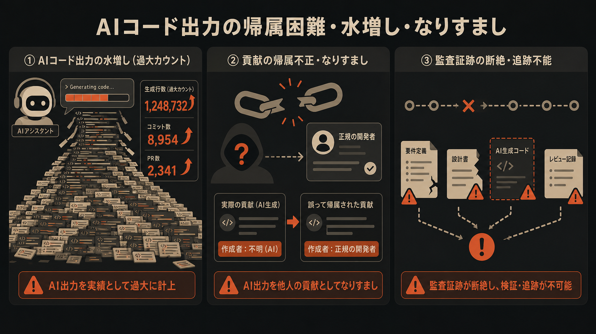
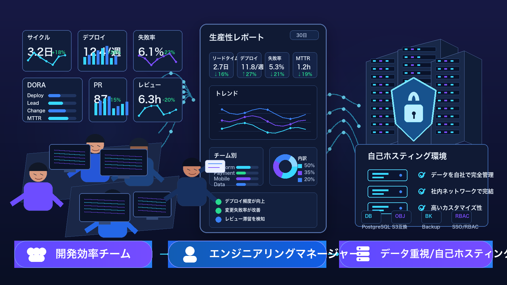
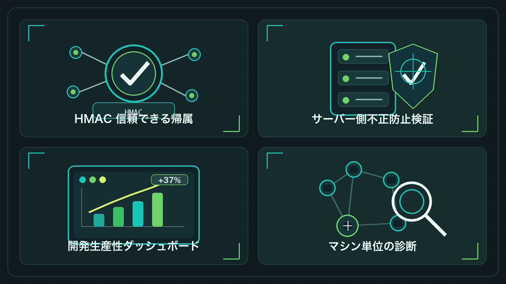
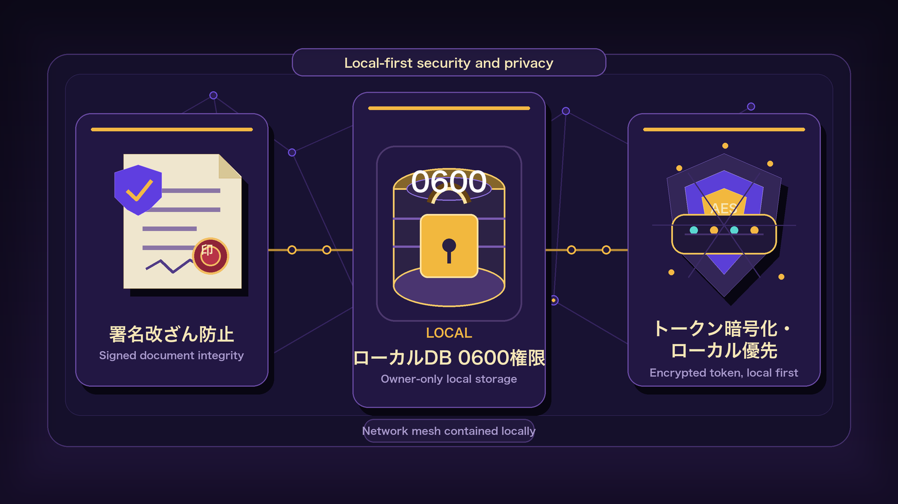

<sub>🌐 <a href="README.md">简体中文</a> · <a href="README.en.md">English</a> · <b>日本語</b> · <a href="README.ko.md">한국어</a></sub>

<div align="center">

# aitrack セルフホスト AI コーディングガバナンス 🛡️

> *「AI コーディングの行動を信頼できる監査へ。エンジニアリング効率チームにリアルなデータを。」*

<a href="https://github.com/MapleEve/company-aitrack/actions/workflows/ci.yml"></a>
<a href="https://codecov.io/gh/MapleEve/company-aitrack"></a>
<a href="https://github.com/MapleEve/company-aitrack/releases"></a>
<a href="LICENSE"></a>
<a href="docs/DEPLOYMENT.md"></a>

<br>
<br>


<br>

aitrack は、従業員の AI コーディング活動を監視・ガバナンスするための、汎用・セルフホスト・オープンソースのツールです。<br>Claude Code、Codex CLI、Cursor には native edit hook adapter を提供し、<br>対応する編集イベントごとに HMAC 署名付きの編集証拠を生成します。<br>そのほかの AI コーディングツールは、動的 agent registry、ハートビート状態、ローカル使用量ソースを通じて管理します。

<br>

[クイックスタート](#クイックスタート) · [アーキテクチャ](#アーキテクチャ) · [デプロイ](docs/DEPLOYMENT.md) · [API](docs/API.md) · [コントリビュート](CONTRIBUTING.md)

</div>

---

## 課題

<p align="center">
  
</p>

AI コーディングツールが開発チームに大規模導入される中、避けられない3つのガバナンス課題が生じています：

| 課題 | 現状 |
|------|------|
| **AI の成果を信頼できる形で帰属できない** | 「AI が書いたコード」と「人が書いたコード」を区別するネイティブな仕組みがなく、統計ツールが形骸化している |
| **行数指標が水増しされやすい** | 単純な貼り付け・無意味な繰り返し・冗長な補完で行数が嵩み、実際の貢献と乖離する |
| **帰属データが改ざんされる可能性がある** | ローカルの統計データは送信前に自由に変更可能で、管理者はデータの信頼性を判断できない |

---

## 対象ユーザー

<p align="center">
  
</p>

| ロール | 主要なニーズ |
|--------|-------------|
| **エンジニアリング効率チーム** | AI ツールの実際の産出物を客観的に定量化し、低効率な使用パターンを特定して月次効率レポートをサポート |
| **エンジニアリングマネージャー** | フックのインストール状態と疑わしいデータフラグをリアルタイムで把握し、開発者の自己申告に依存しない |
| **データセキュリティ重視・セルフホスティングチーム** | すべてのデータが自社ホスティングのインフラに留まり、サードパーティのクラウドサービスを一切経由しないため、コンプライアンス要件を満たす |

---

## アーキテクチャ

aitrack はプロトコル v1.2 で通信する3つの独立したコンポーネントで構成されています：

| コンポーネント | スタック | 役割 |
|--------------|---------|------|
| **Rust クライアント** `aitrack` | Rust · シングルバイナリ · ランタイム依存なし · ヘキサゴナルアーキテクチャ（v1.6） | フックのインストール、編集イベントのキャプチャ、HMAC 署名、データのアップロード、自動更新（ed25519） |
| **Java サーバー** `aitrack-server` | Java 17 · Spring Boot 3.3.8 · H2 / PostgreSQL · ParadeDB（v1.3+） | 10ステップ検証チェーン、信頼できる帰属、効率クエリ、セマンティック検索（主要実装） |
| **Go サーバー** `aitrack-server-go` | Go 1.25 · chi v5.2.5 · PostgreSQL / ParadeDB（必須） | Java と機能同等の軽量代替実装、セマンティック検索をサポート |

**プロトコル v1.2 の主要設計：**

- すべてのアップロードリクエストには `record_sig`（11のコアフィールドをカバーする HMAC-SHA256）とリクエストレベルの HMAC 署名が含まれる
- `POST /admin/tokens` はトークンと HMAC シークレットを統合した単一の `credential` フィールド（`<token>-<hmac_secret>`）を返す
- `hostname` フィールド（v1.1 で新規追加）により、1つのトークンを複数マシンで使用した場合にデバイス次元での手動レビューが可能
- クライアントのローカルデータベース `~/.aitrack/records.db` のパーミッションは 0600、`hmac_secret` は AES-256-GCM で暗号化して保存

**Agent とデータドメインの境界：**

- Claude Code、Codex CLI、Cursor は現在 native edit hook adapter を持ち、diff、行数、リポジトリメタデータ、`record_sig` を含む `EditRecord` を生成できます
- そのほかの登録 agent は registry、status、heartbeat、local usage source のフローに参加できます。native hook がない場合でも、型付きローカルスキャンから prompt、tool、window、復元可能な編集監視イベントを補完できます
- `EditRecord` は編集証拠ドメインです。usage rollup / snapshot はスカラー使用量ドメインであり、token-only または usage-only データを編集レコードとして扱うことはできません
- ローカル使用量ソースには、型付き transcript / session ディレクトリ、JSONL、SQLite、ローカルクライアント状態が含まれます。明示的な import ディレクトリは opt-in の入口であり、aitrack はユーザーにサードパーティの token 貼り付けを求めません

**現在対応している agent framework：**

| agent key | native edit hook | native prompt hook | local transcript scan | usage rollup | quota / subscription snapshot |
|-----------|------------------|--------------------|-------------------------------|--------------|-------------------------------|
| `claude` | あり | あり | あり: `.claude/`、projects、transcripts、`~/.aitrack/sources/claude` | あり | あり: ローカル rate-limit snapshot |
| `codex` | あり | なし | あり: `.codex/sessions`、`~/.aitrack/sources/codex` | あり | あり: session rate-limit snapshot |
| `cursor` | あり | なし | あり: Cursor globalStorage、`~/.aitrack/sources/cursor` | あり | なし |
| default local-scan agents | なし | なし | 型付き native path と明示的な構造化 import root | token、message count、source cost | なし |

デフォルトのローカルスキャンは `claude`、`codex`、`cursor`、`trae`、`qwen`、`antigravity`、`opencode`、`qoder`、`qoder-cn`、`qoder-work`、`qoder-work-cn`、`wukong`、`hermes`、`openclaw`、`gemini`、`copilot`、`cline`、`roo-code`、`kiro`、`zed`、`goose`、`amp`、`droid`、`pi`、`mux`、`crush`、`codebuff`、`kilo`、`kilocode`、`kimi`、`gjc`、`grok`、`synthetic`、`warp`、`zcode` を対象にします。明示的な `--tool` では `roocode`、`kilo-code`、`gajae-code` も alias として受け付けます。デフォルトスキャンは canonical key を使い、同じローカルパスの二重取り込みを避けます。ローカル JSON、JSONL、NDJSON、CSV、SQLite、ローカルソースファイルに prompt、tool、window、edit、token フィールドが含まれていれば、aitrack は対応する監視または usage データ面へ取り込みます。

---

## 得られるもの

<p align="center">
  
</p>

### HMAC による信頼できる帰属

各編集レコードはローカルDBへの書き込み時に `record_sig` を生成します。カバーするフィールドは `token_key`、`device_id`、`hostname`、`timestamp`、`tool`、`file_path`、`repo_url`、`current_sha`、`added_lines`、`removed_lines`、`diff_hunk(SHA-256)` の11フィールドです。サーバーはステップ4で再計算して比較し、いずれかのフィールドが改ざんされていれば検出されます。

### 10ステップサーバー検証チェーン

| ステップ | チェック内容 | 失敗時の結果 |
|---------|------------|------------|
| 1 | Bearer トークンが有効 | `401` |
| 2 | `X-AiTrack-Timestamp` が ±300秒以内（リプレイ防止） | `401` |
| 3 | `X-AiTrack-Signature` リクエスト HMAC が一致 | `401` |
| 4 | `record_sig` が各編集で一致 | `rejected: sig_mismatch` |
| 5 | `diff_hunk` の行数が `added_lines`/`removed_lines` と一致（±1） | `flagged: diff_inconsistent` |
| 6 | `repo_url` がホワイトリスト内（設定可能） | `flagged/rejected: repo_unknown` |
| 7 | `file_path` の妥当性チェック | `flagged: path_mismatch` |
| 8 | `added_lines ≤ 5000` | `flagged: oversized` |
| 9 | レート制限：（token, file_path）ごとに1時間あたり ≤ 30件 | `rejected: rate_limited` |
| 10 | 永続化（承認済み + フラグ付き編集） | — |

### エンジニアリング効率の計測

`GET /api/v1/ai-track/stats?group_by=token|repo|device|hostname|tool` で開発者・リポジトリ・デバイス・ホスト名・agent/tool 次元の集計統計を取得し、効率レポートをサポートします。

### hostname 次元での手動調査

`GET /api/v1/ai-track/devices` で各デバイスのハートビート状態と動的 agent hooks map を確認できます。フックがサイレントに削除された場合、次の `aitrack` コマンド実行時に異常状態が自動的に報告され、管理者が能動的にフォローアップできます。

### サーバー側ベクトルストレージとセマンティック検索（v1.3+）

サーバーデータベースが **ParadeDB**（PostgreSQL + pg_search + pgvector）にアップグレードされ、以下をサポート：

- `GET /api/v1/ai-track/edits/search?q=` — BM25 全文検索、diff_hunk の関連性ランキング
- `POST /api/v1/ai-track/edits/similar` — pgvector HNSW ベクトル ANN 類似検索
- H2/SQLite モードでは両エンドポイントは HTTP 501 を返し、コアアップロードパイプラインに影響なし
- クライアント（v1.3+）は sqlite-vec を統合し、ローカル records.db にベクトル列を追加してオフラインセマンティックストレージを提供

### 開発者 AI 使用プロファイル（v1.4+）

`GET /api/v1/ai-track/profiles/{token_key}` は指定された開発者の AI ツール使用プロファイルを3つの次元で返します：

- **使用頻度**：日次/週次 AI 補助編集回数トレンド
- **使用深度**：編集あたりのコード変更サイズ分布（小規模修正 vs. 大規模生成）
- **言語分布**：ファイル拡張子別のプログラミング言語使用分布

プロファイルデータは AI ツールの実際の採用効果を把握するためのみに使用され、個人のパフォーマンス評価の直接的な根拠としては使用されません。

### プロンプトとローカル transcript 監視（v1.7+）

クライアントはオプションで `UserPromptSubmit` フックをインストールでき、`aitrack usage scan|sync` で agent、時間ウィンドウ、ローカルカーソルキャッシュ単位に型付きローカル session ディレクトリ、JSONL、SQLite、ローカル状態ファイルをスキャンできます。デフォルトは直近ウィンドウの増分スキャンで、明示的な `--since/--until` により小規模なバックフィルを行えます。`prompt_summary` は編集監視レコードと共に有界のプロンプト内容を送信します。native hook がない agent でも、型付きローカルソースから prompt、tool、window、編集監視イベントを復元できます。

`usage` サブコマンドは独立した usage rollup / subscription snapshot データ面も維持します。day、agent、model、account ごとに token bucket、message count、source cost を集計し、`/api/v1/ai-track/usage/*` API 経由で Java または Go サーバーへアップロードします。

### ヘキサゴナルアーキテクチャとセキュアな自動更新（v1.6+）

- Rust クライアントをヘキサゴナルアーキテクチャ（domain / port / adapter の3層）にリファクタリング完了。すべての I/O は `StoragePort` / `UploadPort` インターフェースを通じてルーティングされ、ビジネスロジックとインフラが完全に分離
- `aitrack update` サブコマンド：GitHub Releases から最新バージョンを取得し、ed25519 署名検証後に現在のバイナリをアトミックに置換
- キーワードライブラリ改ざん防止：キーワードはコンパイル時定数としてハードコードされ、`keyword_fingerprint()` がサーバー側検証用の SHA-256 フィンガープリントを計算
- 3コンポーネントすべてのカバレッジ ≥ 90%（Rust 301 tests / Java と Go package tests）

---

## クイックスタート

### 1. サーバーの起動

```bash
# キーの生成
export AITRACK_SECRET_KEY=$(openssl rand -base64 32)
export AITRACK_ADMIN_KEY=$(openssl rand -hex 32)

# ビルドと起動（H2 組み込みデータベース、クイック評価に適切）
docker-compose up -d --build

# サービスの確認
curl http://localhost:8080/actuator/health
```

### 2. クレデンシャルの発行

```bash
curl -X POST http://localhost:8080/admin/tokens \
  -H "X-Admin-Key: $AITRACK_ADMIN_KEY" \
  -H 'Content-Type: application/json' \
  -d '{"owner":"alice","note":"macbook"}'
# credential と token_key が返される — credential は一度のみ表示、安全に保管すること
```

### 3. 開発者側のフックインストール

```bash
# クライアントのビルド
cd client && cargo build --release
# または配布パッケージからバイナリを /usr/local/bin/ に展開

# native edit hook のインストール（Claude Code の例。ほかの登録ツールは --tool <name> を使用）
aitrack init --claude \
  --api-url https://aitrack.example.com \
  --credential <credential>

# ステータスの確認
aitrack status

# ローカルレコードの表示（最新20件）
aitrack inspect --limit 20
```

### 4. チームデータの確認

開発者側からデータが上報されたら、管理者は以下のコマンドでチームの実際の利用状況とデバイス状態を確認できます：

```bash
TOKEN="aitrack_abcdef1234567890abcdef1234567890"  # ステップ2で発行したトークンに置き換える

# 開発者（token）次元の集計効率データを確認 — 月次レポートの入口
curl -s "http://localhost:8080/api/v1/ai-track/stats?group_by=token" \
  -H "Authorization: Bearer $TOKEN"

# 全デバイスのハートビートと agent 状態を確認 — フックまたは登録状態の異常を調査
curl -s "http://localhost:8080/api/v1/ai-track/devices" \
  -H "Authorization: Bearer $TOKEN"
```

`group_by` には `repo`（リポジトリ別）、`device`（デバイス UUID 別）、`hostname`（マシン名別）、`tool`（agent/tool key 別）も指定できます。詳細は [docs/API.md](docs/API.md) を参照してください。

### 5. カバレッジ検証（Docker）

```bash
# クライアント（Rust、カバレッジ閾値 90%）
docker build -f docker/Dockerfile.client -t aitrack-client:latest .

# Java サーバー（JaCoCo LINE >= 90%）
docker build -f docker/Dockerfile.server-java -t aitrack-server-java:latest .

# Go サーバー（go tool cover >= 90%）
docker build -f docker/Dockerfile.server-go -t aitrack-server-go:latest .

# E2E（Java + Go それぞれ1ラウンド）
bash e2e/run.sh both
```

---

## セキュリティとプライバシー

<p align="center">
  
</p>

| 仕組み | 説明 |
|--------|------|
| **record_sig による改ざん防止** | HMAC-SHA256 が11のコアフィールドをカバーし、ローカルDB書き込み時に署名、サーバーが各レコードを検証 |
| **ローカルDB 0600** | `~/.aitrack/config.toml` と `records.db` のパーミッションは 0600、同一マシンの他ユーザーによる読み取りを防止 |
| **トークン AES 暗号化** | `hmac_secret` はサーバー側で AES-256-GCM 暗号化して保存、`AITRACK_SECRET_KEY` の設定が必要 |
| **トークンハッシュ保存** | サーバーは `sha256(token)` のみを保存 — 平文は発行時に一度のみ返される |
| **ローカルファースト** | すべてのデータがセルフホスティングインフラに保存され、サードパーティのクラウドサービスを一切経由しない |
| **定数時間比較** | HMAC 検証はタイミング攻撃を防ぐために定数時間比較を使用 |
| **透明で設定可能な収集** | デフォルトではファイルパス、diff、行数、リポジトリメタデータを収集。prompt hook とローカル transcript スキャンにより、有界の prompt/tool/window 監視イベントを収集可能。usage rollup は使用量のスカラー指標のみを記録する。完全なワークスペースファイルやキーボード入力は収集しない。収集範囲は企業管理者の設定で制御され、プロファイルデータは個人のパフォーマンス評価の直接的な根拠として使用されない |

---

## ドキュメント

| ドキュメント | 説明 |
|------------|------|
| [CONTRACT.md](CONTRACT.md) | クライアント/サーバープロトコル契約（エンドポイント、フィールド定義、署名仕様、フックテンプレート） |
| [docs/ARCHITECTURE.md](docs/ARCHITECTURE.md) | システムアーキテクチャ設計（コンポーネント図、データフロー、デプロイトポロジー） |
| [docs/API.md](docs/API.md) | API リファレンス（全エンドポイント、リクエスト/レスポンス構造） |
| [docs/DEPLOYMENT.md](docs/DEPLOYMENT.md) | デプロイガイド（Docker、PostgreSQL 移行、本番設定） |
| [docs/DEVELOPMENT.md](docs/DEVELOPMENT.md) | 開発者ガイド（ローカルビルド、モジュール構造、コントリビューションフロー） |
| [docs/SECURITY_MODEL.md](docs/SECURITY_MODEL.md) | セキュリティモデル（脅威モデリング、HMAC 仕様、防御レイヤー） |
| [docs/TESTING.md](docs/TESTING.md) | テストシステム（三層アーキテクチャ、ファクトリーパターン、カバレッジ閾値、Docker 検証） |
| [CHANGELOG.md](CHANGELOG.md) | バージョン変更履歴 |
| [CONTRIBUTING.md](CONTRIBUTING.md) | コントリビューションガイド（コミット規則、PR プロセス、テスト要件） |
| [SECURITY.md](SECURITY.md) | セキュリティ脆弱性報告プロセス |

---

## Star History

[](https://www.star-history.com/#MapleEve/company-aitrack&type=date)

---

[MIT License](LICENSE) © 2026 MapleEve
