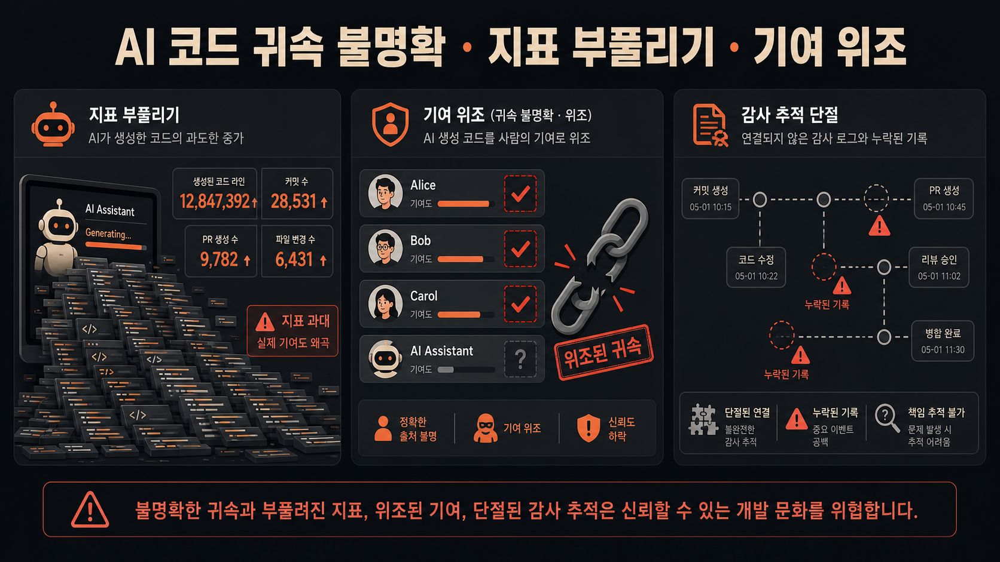
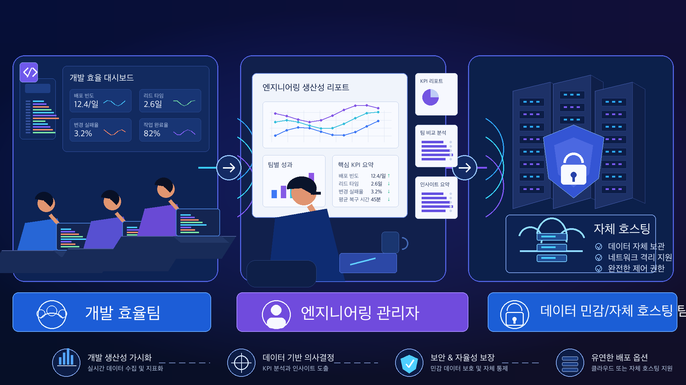
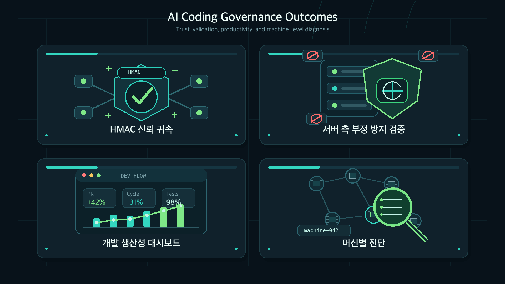

<sub>🌐 <a href="README.md">简体中文</a> · <a href="README.en.md">English</a> · <a href="README.ja.md">日本語</a> · <b>한국어</b></sub>

<div align="center">

# aitrack 셀프 호스팅 AI 코딩 거버넌스 🛡️

> *「AI 코딩 행동을 신뢰할 수 있는 감사에 편입하고, 엔지니어링 효율 팀에 실제 데이터를 돌려줍니다.」*

<a href="https://github.com/MapleEve/company-aitrack/actions/workflows/ci.yml"></a>
<a href="https://codecov.io/gh/MapleEve/company-aitrack"></a>
<a href="https://github.com/MapleEve/company-aitrack/releases"></a>
<a href="LICENSE"></a>
<a href="docs/DEPLOYMENT.md"></a>

<br>
<br>


<br>

aitrack는 직원의 AI 코딩 활동을 모니터링하고 거버넌스하기 위한 범용·셀프 호스팅·오픈소스 도구입니다.<br>Claude Code, Codex CLI, Cursor에는 native edit hook adapter를 제공하여,<br>지원되는 편집 이벤트마다 HMAC 서명된 편집 증거를 생성합니다.<br>그 밖의 AI 코딩 도구는 동적 agent registry, 하트비트 상태, 로컬 사용량 소스를 통해 관리합니다.

<br>

[빠른 시작](#빠른-시작) · [아키텍처](#아키텍처) · [배포](docs/DEPLOYMENT.md) · [API](docs/API.md) · [기여](CONTRIBUTING.md)

</div>

---

## 문제

<p align="center">
  
</p>

AI 코딩 도구가 개발 팀에 대규모로 도입되면서 피할 수 없는 세 가지 거버넌스 과제가 생겼습니다:

| 문제점 | 현실 |
|--------|------|
| **AI 산출물의 신뢰할 수 있는 귀속이 어려움** | "AI가 작성한 코드"와 "사람이 작성한 코드"를 구별하는 네이티브 메커니즘이 없어 통계 도구가 형식화됨 |
| **줄 수 지표 부풀리기가 쉬움** | 단순 붙여넣기, 의미 없는 반복, 중복 자동완성으로 줄 수가 부풀려져 실제 기여와 괴리됨 |
| **귀속 데이터 위조 가능** | 로컬 통계는 제출 전에 자유롭게 수정 가능하여 관리자가 데이터 신뢰도를 판단할 수 없음 |

---

## 대상 사용자

<p align="center">
  
</p>

| 역할 | 핵심 요구사항 |
|------|-------------|
| **엔지니어링 효율 팀** | AI 도구의 실제 산출물을 객관적으로 정량화하고, 비효율적인 사용 패턴을 파악하여 월별 효율 보고서 지원 |
| **엔지니어링 관리자** | native hook 및 등록 agent 상태와 의심스러운 데이터 플래그를 실시간으로 파악하여 개발자 자기 보고에 의존하지 않음 |
| **데이터 보안 중시·셀프 호스팅 팀** | 모든 데이터가 자체 호스팅 인프라에 저장되고 어떠한 서드파티 클라우드 서비스도 경유하지 않아 컴플라이언스 요건 충족 |

---

## 아키텍처

aitrack은 프로토콜 v1.2로 통신하는 세 개의 독립적인 컴포넌트로 구성됩니다:

| 컴포넌트 | 스택 | 역할 |
|---------|------|------|
| **Rust 클라이언트** `aitrack` | Rust · 단일 바이너리 · 런타임 의존성 없음 · 헥사고날 아키텍처(v1.6) | 훅 설치, 편집 이벤트 캡처, HMAC 서명, 데이터 업로드, 자동 업데이트(ed25519) |
| **Java 서버** `aitrack-server` | Java 17 · Spring Boot 3.3.8 · H2 / PostgreSQL · ParadeDB(v1.3+) | 10단계 검증 체인, 신뢰할 수 있는 귀속, 효율 쿼리, 시맨틱 검색(주요 구현) |
| **Go 서버** `aitrack-server-go` | Go 1.25 · chi v5.2.5 · PostgreSQL / ParadeDB(필수) | Java와 기능이 동등한 경량 대안 구현, 시맨틱 검색 지원 |

**프로토콜 v1.2 핵심 설계:**

- 모든 업로드 요청에는 `record_sig`(11개 핵심 필드를 커버하는 HMAC-SHA256)와 요청 수준의 HMAC 서명이 포함됨
- `POST /admin/tokens`는 토큰과 HMAC 시크릿을 통합한 단일 `credential` 필드(`<token>-<hmac_secret>`)를 반환
- `hostname` 필드(v1.1에서 신규 추가)로 하나의 토큰을 여러 머신에서 사용할 때 디바이스 차원의 수동 검토가 가능
- 클라이언트 로컬 데이터베이스 `~/.aitrack/records.db` 권한 0600, `hmac_secret`은 AES-256-GCM으로 암호화하여 저장

**Agent 및 데이터 도메인 경계:**

- Claude Code, Codex CLI, Cursor는 현재 native edit hook adapter를 갖고 있어 diff, 줄 수, 저장소 메타데이터, `record_sig`를 포함한 `EditRecord`를 생성할 수 있습니다
- 그 밖의 등록 agent는 registry, status, heartbeat, local usage source 흐름에 참여할 수 있습니다. native hook 이 없어도 로컬 transcript 스캔으로 prompt, tool, window, 복원 가능한 edit 모니터링 이벤트를 보완할 수 있습니다
- `EditRecord`는 편집 증거 도메인입니다. usage rollup / snapshot은 스칼라 사용량 도메인이며, token-only 또는 usage-only 데이터를 편집 레코드로 취급할 수 없습니다
- 로컬 사용량 소스에는 로컬 로그, JSONL, SQLite, 캐시, 로컬 클라이언트 상태가 포함됩니다. aitrack는 가능한 로컬 자격 증명 또는 진입점을 자동 발견하며, 사용자에게 서드파티 token을 수동으로 붙여 넣도록 요구하지 않습니다

**현재 지원되는 agent framework:**

| agent key | native edit hook | native prompt hook | local transcript scan | usage rollup | quota / subscription snapshot |
|-----------|------------------|--------------------|-------------------------------|--------------|-------------------------------|
| `claude` | 지원 | 지원 | 지원: `.claude/`, projects, transcripts, `~/.aitrack/sources/claude` | 지원 | 지원: 로컬 rate-limit snapshot |
| `codex` | 지원 | 미지원 | 지원: `.codex/sessions`, `~/.aitrack/sources/codex` | 지원 | 지원: session rate-limit snapshot |
| `cursor` | 지원 | 미지원 | 지원: Cursor globalStorage, `~/.aitrack/sources/cursor` | 지원 | 미지원 |
| default local-scan agents | 미지원 | 미지원 | 로컬 agent 디렉터리, 앱 데이터, JSON/JSONL/NDJSON, CSV, SQLite, `~/.aitrack/sources/<agent>` | token, message count, source cost | 미지원 |

기본 로컬 스캔은 `claude`, `codex`, `cursor`, `trae`, `qwen`, `antigravity`, `opencode`, `qoder`, `qoder-cn`, `qoder-work`, `qoder-work-cn`, `wukong`, `hermes`, `openclaw`, `gemini`, `copilot`, `cline`, `roo-code`, `kiro`, `zed`, `goose`, `amp`, `droid`, `pi`, `mux`, `crush`, `codebuff`, `kilo`, `kilocode`, `kimi`, `gjc`, `grok`, `synthetic`, `warp`, `zcode` 를 대상으로 합니다. 명시적인 `--tool` 은 `roocode`, `kilo-code`, `gajae-code` 도 alias 로 허용합니다. 기본 스캔은 canonical key 를 사용해 같은 로컬 경로의 중복 수집을 피합니다. 로컬 JSON, JSONL, NDJSON, CSV, SQLite, 로컬 source 파일에 prompt, tool, window, edit, token 필드가 있으면 aitrack 가 해당 모니터링 또는 usage 데이터면으로 수집합니다.

---

## 얻을 수 있는 것

<p align="center">
  
</p>

### HMAC 신뢰할 수 있는 귀속

각 편집 레코드는 로컬 DB 저장 시 `record_sig`를 생성합니다. 커버하는 필드는 `token_key`, `device_id`, `hostname`, `timestamp`, `tool`, `file_path`, `repo_url`, `current_sha`, `added_lines`, `removed_lines`, `diff_hunk(SHA-256)` 등 11개 필드입니다. 서버는 4단계에서 재계산하여 비교하며, 어떠한 필드가 변조되었더라도 탐지됩니다.

### 10단계 서버 검증 체인

| 단계 | 검사 내용 | 실패 결과 |
|------|---------|----------|
| 1 | Bearer 토큰 유효 | `401` |
| 2 | `X-AiTrack-Timestamp`가 ±300초 이내(리플레이 방지) | `401` |
| 3 | `X-AiTrack-Signature` 요청 HMAC 일치 | `401` |
| 4 | `record_sig`가 각 편집 건별로 일치 | `rejected: sig_mismatch` |
| 5 | `diff_hunk` 줄 수가 `added_lines`/`removed_lines`와 일치(±1) | `flagged: diff_inconsistent` |
| 6 | `repo_url`이 화이트리스트에 포함(설정 가능) | `flagged/rejected: repo_unknown` |
| 7 | `file_path` 타당성 검사 | `flagged: path_mismatch` |
| 8 | `added_lines ≤ 5000` | `flagged: oversized` |
| 9 | 속도 제한: (token, file_path)당 시간당 ≤ 30건 | `rejected: rate_limited` |
| 10 | 영속화(승인됨 + 플래그됨 편집) | — |

### 엔지니어링 효율 측정

`GET /api/v1/ai-track/stats?group_by=token|repo|device|hostname|tool`로 개발자, 저장소, 디바이스, 호스트명 또는 agent/tool 차원의 집계 통계를 조회하여 효율 보고서를 지원합니다.

### hostname 차원 수동 조사

`GET /api/v1/ai-track/devices`에서 각 디바이스의 하트비트 상태와 동적 agent hooks map을 확인할 수 있습니다. 훅이 조용히 제거되면 다음 `aitrack` 명령 실행 시 이상 상태가 자동으로 보고되어 관리자가 능동적으로 후속 조치를 취할 수 있습니다.

### 서버 측 벡터 스토리지 및 시맨틱 검색(v1.3+)

서버 데이터베이스가 **ParadeDB**(PostgreSQL + pg_search + pgvector)로 업그레이드되어 다음을 지원합니다:

- `GET /api/v1/ai-track/edits/search?q=` — BM25 전문 검색, diff_hunk 관련성 순위 지정
- `POST /api/v1/ai-track/edits/similar` — pgvector HNSW 벡터 ANN 유사도 검색
- H2/SQLite 모드에서 두 엔드포인트는 HTTP 501을 반환하며 핵심 업로드 파이프라인에 영향 없음
- 클라이언트(v1.3+)는 sqlite-vec를 통합하여 로컬 records.db에 벡터 열을 추가하고 오프라인 시맨틱 스토리지 제공

### 개발자 AI 사용 프로필(v1.4+)

`GET /api/v1/ai-track/profiles/{token_key}`는 지정된 개발자의 AI 도구 사용 프로필을 세 가지 차원으로 반환합니다:

- **사용 빈도**: 일별/주별 AI 보조 편집 횟수 트렌드
- **사용 깊이**: 편집당 코드 변경 규모 분포(소규모 수정 vs. 대규모 생성)
- **언어 분포**: 파일 확장자별 프로그래밍 언어 사용 분포

프로필 데이터는 AI 도구의 실제 채택 효과를 파악하기 위해서만 사용되며, 개인 성과 평가의 직접적인 근거로는 사용되지 않습니다.

### 프롬프트 및 로컬 transcript 모니터링(v1.7+)

클라이언트는 선택적으로 `UserPromptSubmit` 훅을 설치할 수 있으며, `aitrack usage scan|sync` 로 agent, 시간 창, 로컬 커서 캐시 기준으로 로컬 agent 로그, JSONL, SQLite, 캐시를 스캔할 수 있습니다. 기본 모드는 최근 창의 증분 스캔이며, 명시적인 `--since/--until` 로 작은 범위의 백필을 수행합니다. `prompt_summary` 는 편집 모니터링 레코드와 함께 제한된 길이의 프롬프트 내용을 전송합니다. native hook 이 없는 agent 도 로컬 transcript 에서 prompt, tool, window, edit 모니터링 이벤트를 복원할 수 있습니다.

`usage` 서브커맨드는 별도의 usage rollup / subscription snapshot 데이터면도 유지합니다. day, agent, model, account 기준으로 token bucket, message count, source cost 를 집계하고 `/api/v1/ai-track/usage/*` API 를 통해 Java 또는 Go 서버로 업로드합니다.

### 헥사고날 아키텍처 및 보안 자동 업데이트(v1.6+)

- Rust 클라이언트가 헥사고날 아키텍처(domain / port / adapter 3계층)로 리팩터링 완료. 모든 I/O는 `StoragePort` / `UploadPort` 인터페이스를 통해 라우팅되어 비즈니스 로직과 인프라가 완전히 분리
- `aitrack update` 서브커맨드: GitHub Releases에서 최신 버전을 가져와 ed25519 서명 검증 후 현재 바이너리를 원자적으로 교체
- 키워드 라이브러리 변조 방지: 키워드는 컴파일 타임 상수로 하드코딩되어 있으며, `keyword_fingerprint()`가 서버 측 검증을 위한 SHA-256 지문을 계산
- 세 컴포넌트 모두 커버리지 ≥ 90%(Rust 301 tests / Java 및 Go package tests)

---

## 빠른 시작

### 1. 서버 시작

```bash
# 키 생성
export AITRACK_SECRET_KEY=$(openssl rand -base64 32)
export AITRACK_ADMIN_KEY=$(openssl rand -hex 32)

# 빌드 및 시작(H2 임베디드 데이터베이스, 빠른 평가에 적합)
docker-compose up -d --build

# 서비스 확인
curl http://localhost:8080/actuator/health
```

### 2. 크레덴셜 발급

```bash
curl -X POST http://localhost:8080/admin/tokens \
  -H "X-Admin-Key: $AITRACK_ADMIN_KEY" \
  -H 'Content-Type: application/json' \
  -d '{"owner":"alice","note":"macbook"}'
# credential과 token_key가 반환됨 — credential은 한 번만 표시되므로 안전하게 보관할 것
```

### 3. 개발자 측 훅 설치

```bash
# 클라이언트 빌드
cd client && cargo build --release
# 또는 배포 패키지에서 바이너리를 /usr/local/bin/에 압축 해제

# native edit hook 설치(Claude Code 예시, 다른 등록 도구는 --tool <name> 사용)
aitrack init --claude \
  --api-url https://aitrack.example.com \
  --credential <credential>

# 상태 확인
aitrack status

# 로컬 레코드 보기(최근 20건)
aitrack inspect --limit 20
```

### 4. 팀 데이터 확인

개발자 측에서 데이터가 업로드되면, 관리자는 다음 명령으로 팀의 실제 사용량과 디바이스 상태를 확인할 수 있습니다:

```bash
TOKEN="aitrack_abcdef1234567890abcdef1234567890"  # 2단계에서 발급한 token으로 교체

# 개발자(token) 차원의 집계 효율 데이터 확인 — 월별 보고서 입구
curl -s "http://localhost:8080/api/v1/ai-track/stats?group_by=token" \
  -H "Authorization: Bearer $TOKEN"

# 모든 디바이스의 하트비트와 agent 상태 확인 — hook 또는 등록 상태 이상 조사
curl -s "http://localhost:8080/api/v1/ai-track/devices" \
  -H "Authorization: Bearer $TOKEN"
```

`group_by`에는 `repo`(저장소별), `device`(디바이스 UUID별), `hostname`(머신명별), `tool`(agent/tool key별)도 사용할 수 있습니다. 자세한 내용은 [docs/API.md](docs/API.md)를 참조하세요.

### 5. 커버리지 검증(Docker)

```bash
# 클라이언트(Rust, 커버리지 임계값 90%)
docker build -f docker/Dockerfile.client -t aitrack-client:latest .

# Java 서버(JaCoCo LINE >= 90%)
docker build -f docker/Dockerfile.server-java -t aitrack-server-java:latest .

# Go 서버(go tool cover >= 90%)
docker build -f docker/Dockerfile.server-go -t aitrack-server-go:latest .

# E2E(Java + Go 각 1라운드)
bash e2e/run.sh both
```

---

## 보안 및 개인정보 보호

<p align="center">
  
</p>

| 메커니즘 | 설명 |
|---------|------|
| **record_sig 변조 방지** | HMAC-SHA256이 11개 핵심 필드를 커버하여 로컬 DB 저장 시 서명, 서버가 레코드별로 검증 |
| **로컬 DB 0600** | `~/.aitrack/config.toml`과 `records.db` 권한이 0600이어서 동일 머신의 다른 사용자 읽기 방지 |
| **토큰 AES 암호화** | `hmac_secret`은 서버 측에서 AES-256-GCM으로 암호화하여 저장, `AITRACK_SECRET_KEY` 설정 필요 |
| **토큰 해시 저장** | 서버는 `sha256(token)`만 저장 — 평문은 발급 시 한 번만 반환됨 |
| **로컬 우선** | 모든 데이터가 셀프 호스팅 인프라에 저장되고 어떠한 서드파티 클라우드 서비스도 경유하지 않음 |
| **상수 시간 비교** | HMAC 검증은 타이밍 공격을 방지하기 위해 상수 시간 비교를 사용 |
| **투명하고 설정 가능한 수집** | 기본적으로 파일 경로, diff, 줄 수, 저장소 메타데이터를 수집; prompt hook 과 로컬 transcript 스캔은 제한된 prompt/tool/window 모니터링 이벤트를 수집할 수 있음; usage rollup 은 사용량 스칼라 지표만 기록; 전체 워크스페이스 파일이나 키보드 입력은 수집하지 않음; 수집 범위는 기업 관리자 구성으로 제어되며, 프로필 데이터는 개인 성과 평가의 직접적인 근거로 사용되지 않음 |

---

## 문서

| 문서 | 설명 |
|------|------|
| [CONTRACT.md](CONTRACT.md) | 클라이언트/서버 프로토콜 계약(엔드포인트, 필드 정의, 서명 사양, 훅 템플릿) |
| [docs/ARCHITECTURE.md](docs/ARCHITECTURE.md) | 시스템 아키텍처 설계(컴포넌트 다이어그램, 데이터 흐름, 배포 토폴로지) |
| [docs/API.md](docs/API.md) | API 레퍼런스(모든 엔드포인트, 요청/응답 구조) |
| [docs/DEPLOYMENT.md](docs/DEPLOYMENT.md) | 배포 가이드(Docker, PostgreSQL 마이그레이션, 프로덕션 설정) |
| [docs/DEVELOPMENT.md](docs/DEVELOPMENT.md) | 개발자 가이드(로컬 빌드, 모듈 구조, 기여 워크플로) |
| [docs/SECURITY_MODEL.md](docs/SECURITY_MODEL.md) | 보안 모델(위협 모델링, HMAC 사양, 방어 레이어) |
| [docs/TESTING.md](docs/TESTING.md) | 테스트 시스템(3계층 아키텍처, 팩토리 패턴, 커버리지 임계값, Docker 검증) |
| [CHANGELOG.md](CHANGELOG.md) | 버전 변경 이력 |
| [CONTRIBUTING.md](CONTRIBUTING.md) | 기여 가이드(커밋 규칙, PR 프로세스, 테스트 요건) |
| [SECURITY.md](SECURITY.md) | 보안 취약점 보고 프로세스 |

---

## Star History

[](https://www.star-history.com/#MapleEve/company-aitrack&type=date)

---

[MIT License](LICENSE) © 2026 MapleEve
