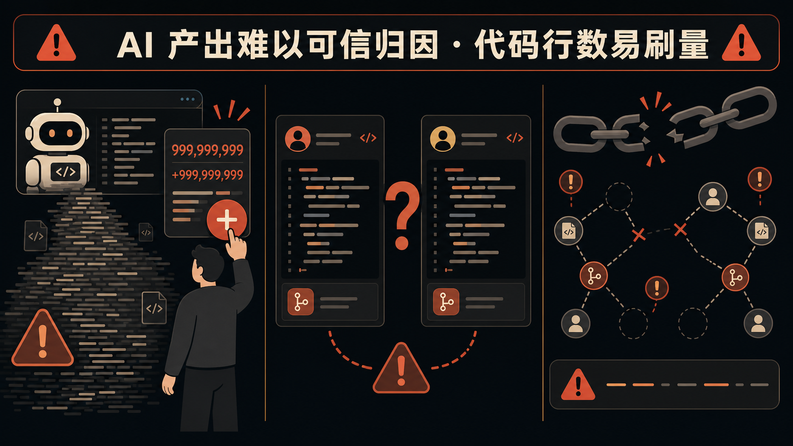
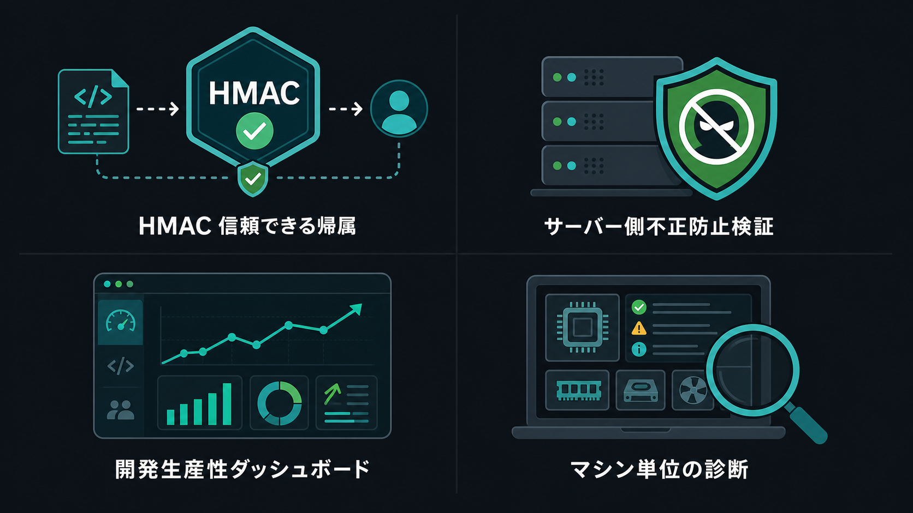
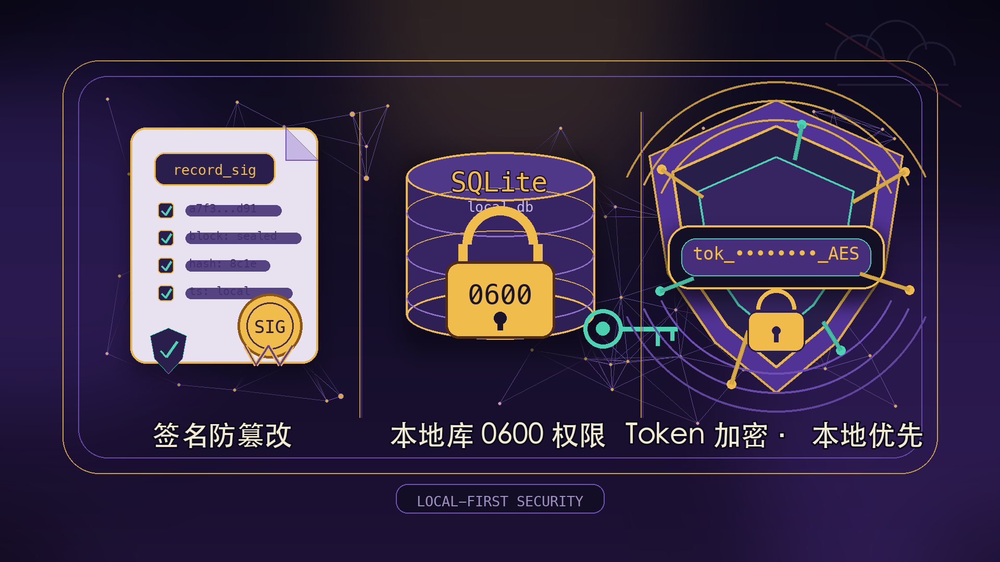

<sub>🌐 <b>简体中文</b> · <a href="README.en.md">English</a> · <a href="README.ja.md">日本語</a> · <a href="README.ko.md">한국어</a></sub>

<div align="center">

# aitrack 自托管 AI 编码治理 🛡️

> *「把 AI 编码行为纳入可信审计，还给研发效能团队一份真实数据。」*

<a href="https://github.com/MapleEve/company-aitrack/actions/workflows/ci.yml"></a>
<a href="https://codecov.io/gh/MapleEve/company-aitrack"></a>
<a href="https://github.com/MapleEve/company-aitrack/releases"></a>
<a href="LICENSE"></a>
<a href="docs/DEPLOYMENT.md"></a>

<br>
<br>


<br>

aitrack 是通用、自托管、开源的员工 AI 编码监控与治理工具。<br>它为 Claude Code、Codex CLI、Cursor 提供原生编辑钩子适配器，<br>在每次编辑事件发生时生成带 HMAC 签名的编辑证据，<br>并通过动态工具注册表、状态心跳与本地用量扫描覆盖更多 AI 编码工具。

<br>

[快速开始](#快速开始) · [支持范围](docs/AGENT_SUPPORT.md) · [架构](#架构) · [部署](docs/DEPLOYMENT.md) · [API](docs/API.md) · [贡献](CONTRIBUTING.md)

</div>

---

## 问题

<p align="center">
  
</p>

AI 编码工具大规模进入研发团队，带来了三个难以回避的治理挑战：

| 痛点 | 现状 |
|------|------|
| **AI 产出难可信归因** | 没有原生机制区分"AI 写的"与"人工写的"，统计工具形同虚设 |
| **行数指标易灌水** | 简单粘贴、无意义重复、补全冗余均可刷高行数，与实际贡献脱节 |
| **归属数据可伪造** | 本地统计在上报前可被任意修改，管理员无法判断数据可信度 |

---

## 适合谁

<p align="center">
  
</p>

| 角色 | 核心需求 |
|------|----------|
| **研发效能团队** | 客观量化 AI 工具实际产出，识别低效使用模式，支撑效能月报 |
| **工程效能管理者** | 实时感知原生钩子、注册工具状态和可疑数据标记，避免被动依赖开发者自报告 |
| **数据敏感·自托管团队** | 所有数据留存于自建服务，不经过任何第三方云服务，满足合规要求 |

---

## 当前支持范围

v1.7.0 之后，aitrack 的采集能力分成三层，不再只围绕三条固定钩子：

| 层级 | 已支持能力 | 适用工具 |
|------|------------|----------|
| 原生编辑证据 | 生成带 diff、行数、仓库信息和 `record_sig` 的 `EditRecord` | Claude Code、Codex CLI、Cursor |
| 状态心跳 | 动态上报工具注册状态、钩子状态和本地可见性 | 已登记工具 key 和显式别名 |
| 本地用量扫描 | 按各工具文档和本地数据结构读取本机会话、导出、遥测或本地数据库；只在来源本身提供字段时提取提示词、输出、工具调用、token、消息数和成本估算 | 默认 30 个工具 key；可用 `--tool` 限定范围 |

默认扫描覆盖 `claude`、`codex`、`cursor`、`trae`、`qwen`、`opencode`、`qoder`、`qoder-cn`、`wukong`、`hermes`、`openclaw`、`gemini`、`copilot`、`cline`、`kiro`、`zed`、`goose`、`amp`、`droid`、`pi`、`mux`、`crush`、`codebuff`、`kilo`、`kilocode`、`kimi`、`gjc`、`grok`、`warp`、`zcode`。显式 `--tool` 还接受 `roocode`、`kilo-code`、`gajae-code` 作为别名；`antigravity`、`qoder-work`、`qoder-work-cn`、`roo-code`、`synthetic` 只保留登记或显式入口，不计入默认本地扫描矩阵。

其中 `claude`、`codex`、`cursor` 使用原生 hook 捕获编辑和提示词上下文；`gemini`、`qwen`、`copilot`、`droid` 读取本地遥测；其他默认扫描工具按各自稳定来源读取导出、统计、会话文本、wire 记录、轨迹或本地数据库。任何来源缺失的字段都不会被补成假数据。

详细支持矩阵、扫描路径、性能上限和管理员解读方式见 [AI 编码工具支持矩阵](docs/AGENT_SUPPORT.md)。

---

## 架构

aitrack 由三个独立组件构成，通过协议 v1.2 互通：

| 组件 | 技术栈 | 职责 |
|------|--------|------|
| **Rust 客户端** `aitrack` | Rust · 单一二进制 · 无运行时依赖 · 六边形架构（v1.6） | 安装钩子、捕获编辑事件、扫描本地用量来源、HMAC 签名、上报数据、自动更新（ed25519） |
| **Java 服务端** `aitrack-server` | Java 17 · Spring Boot 3.3.8 · H2 / PostgreSQL · ParadeDB（v1.3+） | 10 步校验链、可信归因、效能查询、语义检索（主推实现） |
| **Go 服务端** `aitrack-server-go` | Go 1.25 · chi v5.2.5 · PostgreSQL / ParadeDB（必须，v1.6.1 起无 SQLite 回退） | 与 Java 端功能对等的轻量备选实现，支持语义检索 |

**协议 v1.2 关键设计：**

- 所有上报请求均附带 `record_sig`（HMAC-SHA256 覆盖 11 个核心字段）和请求级 HMAC 签名
- `POST /admin/tokens` 返回单一 `credential` 字段（`<token>-<hmac_secret>`），简化签发与客户端配置
- `hostname` 字段（v1.1 新增）使同一 token 在多台机器上的活动可按设备维度人工审查
- 客户端本地数据库 `~/.aitrack/records.db` 权限 0600，`hmac_secret` AES-256-GCM 加密存储

**工具与数据域边界：**

- `EditRecord` 是监控事件域，适合存放签名编辑证据和来源中可还原的提示词、工具调用、窗口、编辑监控事件。
- 用量汇总和额度/订阅快照是标量用量域，适合存放 token、消息数、成本估算和剩余额度。
- 纯 token 或纯用量数据不能伪装成监控事件。
- 本地用量扫描只读取本机可见文件、本地导出和本地状态，不要求用户手动粘贴第三方服务 token。
- `hooks.<tool> = true` 表示该工具在本机可见或对应钩子可用，不等同于该工具已有原生编辑钩子。

---

## 你会得到什么

<p align="center">
  
</p>

### HMAC 可信归因

每条编辑记录在本地落库时即生成 `record_sig`，覆盖 `token_key`、`device_id`、`hostname`、`timestamp`、`tool`、`file_path`、`repo_url`、`current_sha`、`added_lines`、`removed_lines`、`diff_hunk(SHA-256)` 共 11 个字段。服务端在步骤 4 重新计算并对比，任何字段被篡改均会被检出。

### 10 步服务端校验链

| 步骤 | 检查内容 | 失败结果 |
|------|----------|----------|
| 1 | Bearer token 有效 | `401` |
| 2 | `X-AiTrack-Timestamp` 在 ±300s 内（防重放） | `401` |
| 3 | `X-AiTrack-Signature` 请求 HMAC 匹配 | `401` |
| 4 | `record_sig` 逐条匹配 | `rejected: sig_mismatch` |
| 5 | `diff_hunk` 行数与 `added_lines`/`removed_lines` 一致（±1） | `flagged: diff_inconsistent` |
| 6 | `repo_url` 在白名单内（可配置） | `flagged/rejected: repo_unknown` |
| 7 | `file_path` 合理性校验 | `flagged: path_mismatch` |
| 8 | `added_lines ≤ 5000` | `flagged: oversized` |
| 9 | 限流：每（token, file_path）每小时 ≤ 30 条 | `rejected: rate_limited` |
| 10 | 持久化（已接受 + 已标记） | — |

### 研发效能度量

通过 `GET /api/v1/ai-track/stats?group_by=token|repo|device|hostname|tool` 按开发者、仓库、设备、机器名或 agent/tool 维度聚合统计，支撑效能报告。

### 按机器名维度人工排查

`GET /api/v1/ai-track/devices` 展示每台设备的心跳状态与动态工具状态图。钩子被静默移除时，下次任意命令执行后心跳自动上报异常状态，管理员可主动跟进。

### 服务端向量化存储与语义检索（v1.3+）

服务端数据库升级至 **ParadeDB**（PostgreSQL + pg_search + pgvector），支持：

- `GET /api/v1/ai-track/edits/search?q=` — BM25 全文检索，对 diff_hunk 做相关性排序
- `POST /api/v1/ai-track/edits/similar` — pgvector HNSW 向量 ANN 相似检索
- H2/SQLite 模式下两端点返回 HTTP 501，不影响核心上报链路
- 客户端（v1.3+）集成 sqlite-vec，本地 records.db 新增向量列，支持离线语义存储

### 开发者 AI 工具使用画像（v1.4+）

`GET /api/v1/ai-track/profiles/{token_key}` 返回指定开发者的 AI 工具使用画像，包含三个维度：

- **使用频率**：每日/每周 AI 辅助编辑次数趋势
- **使用深度**：单次编辑的代码变更规模分布（小幅修改 vs. 大段生成）
- **语言分布**：按文件扩展名统计的编程语言使用分布

画像数据仅用于了解 AI 工具实际采用效果，不作为个人绩效考核的直接依据。

### 提示词与本地会话记录监控（v1.7+）

客户端可选安装本地提示词钩子，并可通过 `aitrack usage scan|sync` 按工具、时间窗口和本地游标缓存扫描本机会话目录、导出文件、遥测日志、JSONL、SQLite 和本地状态文件；默认近窗口增量扫描，显式 `--since/--until` 用于小范围回填，单次扫描窗口最多 30 天。`prompt_summary` 用于随编辑记录上报有界提示词内容；没有原生钩子的工具只在稳定本地来源提供对应字段时补齐提示词、工具调用、窗口和编辑监控事件。

`usage` 子命令同时维护独立的用量汇总和额度/订阅快照数据面，按日期、工具、模型、账号聚合 token 分桶、消息数和成本估算，并通过 `/api/v1/ai-track/usage/*` API 上报到 Java 或 Go 服务端。

### 六边形架构与安全自动更新（v1.6+）

- Rust 客户端完成六边形架构重构（domain / port / adapter 三层），所有 I/O 通过 `StoragePort` / `UploadPort` 接口路由，业务逻辑与基础设施彻底解耦
- `aitrack update` 子命令：从 GitHub Releases 拉取最新版本，ed25519 签名验证通过后原子替换当前二进制
- 关键词库防篡改：关键词以编译期常量硬编码，`keyword_fingerprint()` 计算 SHA-256 指纹供服务端校验
- 三端覆盖率均 ≥ 90%（Rust 单测、Java 和 Go package tests）

---

## 快速开始

### 1. 启动服务端

```bash
# 生成密钥
export AITRACK_SECRET_KEY=$(openssl rand -base64 32)
export AITRACK_ADMIN_KEY=$(openssl rand -hex 32)

# 启动 Java 服务端（H2 嵌入式数据库，适合快速体验）
docker compose -f docker/docker-compose.yml --profile java up -d

# 验证服务
curl http://localhost:8080/actuator/health
```

### 2. 签发 credential

```bash
curl -X POST http://localhost:8080/admin/tokens \
  -H "X-Admin-Key: $AITRACK_ADMIN_KEY" \
  -H 'Content-Type: application/json' \
  -d '{"owner":"alice","note":"macbook"}'
# 返回 credential 和 token_key，credential 仅显示一次，请妥善保存
```

### 3. 开发者侧安装钩子

```bash
# 构建客户端
cd client && cargo build --release
# 或从分发包解压二进制到 /usr/local/bin/

# 安装原生编辑钩子（Claude Code 示例；其他注册工具可用 --tool <name>）
aitrack init --claude \
  --api-url https://aitrack.example.com \
  --credential <credential>

# 验证状态
aitrack status

# 查看本地记录（最近 20 条）
aitrack inspect --limit 20

# 扫描本机 AI 编码工具用量；不指定 --tool 时扫描默认 30 个工具 key
aitrack usage scan

# 扫描、汇总并上传用量，也会上传本地会话记录中可还原的监控事件
aitrack usage sync \
  --api-url https://aitrack.example.com \
  --credential <credential>
```

### 4. 查看团队数据

开发者侧有数据上报后，管理员可通过以下命令查看团队实际用量与设备状态：

```bash
TOKEN="aitrack_abcdef1234567890abcdef1234567890"  # 替换为步骤 2 签发的 token

# 按开发者（token）维度查看汇总效能数据 — 效能月报入口
curl -s "http://localhost:8080/api/v1/ai-track/stats?group_by=token" \
  -H "Authorization: Bearer $TOKEN"

# 查看所有设备心跳与工具状态 — 排查钩子或注册状态异常
curl -s "http://localhost:8080/api/v1/ai-track/devices" \
  -H "Authorization: Bearer $TOKEN"
```

`group_by` 还支持 `repo`（按仓库）、`device`（按设备 UUID）、`hostname`（按机器名）和 `tool`（按工具 key）。详见 [docs/API.md](docs/API.md)。

### 5. 服务端覆盖率验证（Docker）

服务端镜像构建阶段内置覆盖率门槛（≥ 90%），构建失败即阻断发布。

```bash
# Java 服务端（JaCoCo LINE ≥ 90%）
docker build -f docker/Dockerfile.server-java -t aitrack-server-java:latest .

# Go 服务端（go tool cover ≥ 90%）
docker build -f docker/Dockerfile.server-go -t aitrack-server-go:latest .

# E2E（Java + Go 各一轮）
bash e2e/run.sh both
```

> **Rust 客户端**通过 GitHub CI 构建，覆盖率在 CI 流水线中验证（非 Docker）。预构建二进制见 [Releases](https://github.com/MapleEve/company-aitrack/releases)，开发者本机安装后可通过 `aitrack update` 自动更新到最新版本。

---

## 安全与隐私

<p align="center">
  
</p>

| 机制 | 说明 |
|------|------|
| **record_sig 防篡改** | HMAC-SHA256 覆盖 11 个核心字段，本地落库即签名，服务端逐条核验 |
| **本地库 0600** | `~/.aitrack/config.toml` 和 `records.db` 权限均为 0600，防止同机其他用户读取 |
| **token AES 加密** | `hmac_secret` 在服务端以 AES-256-GCM 加密存储，需设置 `AITRACK_SECRET_KEY` |
| **token 哈希存储** | 服务端仅存储 `sha256(token)`，明文仅签发时返回一次 |
| **本地优先** | 所有数据存储于自建服务，不经过任何第三方云服务 |
| **常量时间比较** | HMAC 验证使用常量时间比较，防止 timing attack |
| **采集范围透明可控** | 默认采集文件路径、diff、行数、仓库元数据；提示词钩子与稳定本地来源可采集有界提示词、工具调用、窗口监控事件；用量汇总只记录标量指标；不采集完整工作区文件或键盘输入；采集范围由企业管理员配置控制，画像数据不作为个人绩效考核直接依据 |

---

## 文档

| 文档 | 说明 |
|------|------|
| [CONTRACT.md](CONTRACT.md) | 客户端/服务端协议契约（端点、字段定义、签名规范、钩子模板） |
| [docs/AGENT_SUPPORT.md](docs/AGENT_SUPPORT.md) | AI 编码工具支持矩阵（原生钩子、本地扫描、用量汇总、额度快照、扫描上限） |
| [docs/ARCHITECTURE.md](docs/ARCHITECTURE.md) | 系统架构设计（组件图、数据流、部署拓扑） |
| [docs/API.md](docs/API.md) | API 文档（所有端点、请求/响应结构） |
| [docs/DEPLOYMENT.md](docs/DEPLOYMENT.md) | 部署指南（Docker、PostgreSQL 切换、生产配置） |
| [docs/DEVELOPMENT.md](docs/DEVELOPMENT.md) | 开发者指南（本地构建、模块结构、贡献流程） |
| [docs/SECURITY_MODEL.md](docs/SECURITY_MODEL.md) | 安全模型（威胁建模、HMAC 规范、防御层次） |
| [docs/TESTING.md](docs/TESTING.md) | 测试体系（三层架构、工厂模式、覆盖率门槛、Docker 验证） |
| [CHANGELOG.md](CHANGELOG.md) | 版本变更记录 |
| [CONTRIBUTING.md](CONTRIBUTING.md) | 贡献指南（提交规范、PR 流程、测试要求） |
| [SECURITY.md](SECURITY.md) | 安全漏洞报告流程 |

---

## Star History

[](https://www.star-history.com/#MapleEve/company-aitrack&type=date)

---

## 致谢

[](https://linux.do)

感谢 **`linux.do`** 社区的讨论、分享与支持。这个项目在工程实践、设计思路和持续迭代上，都受益于社区氛围与成员交流。

---

[MIT License](LICENSE) © 2026 MapleEve
